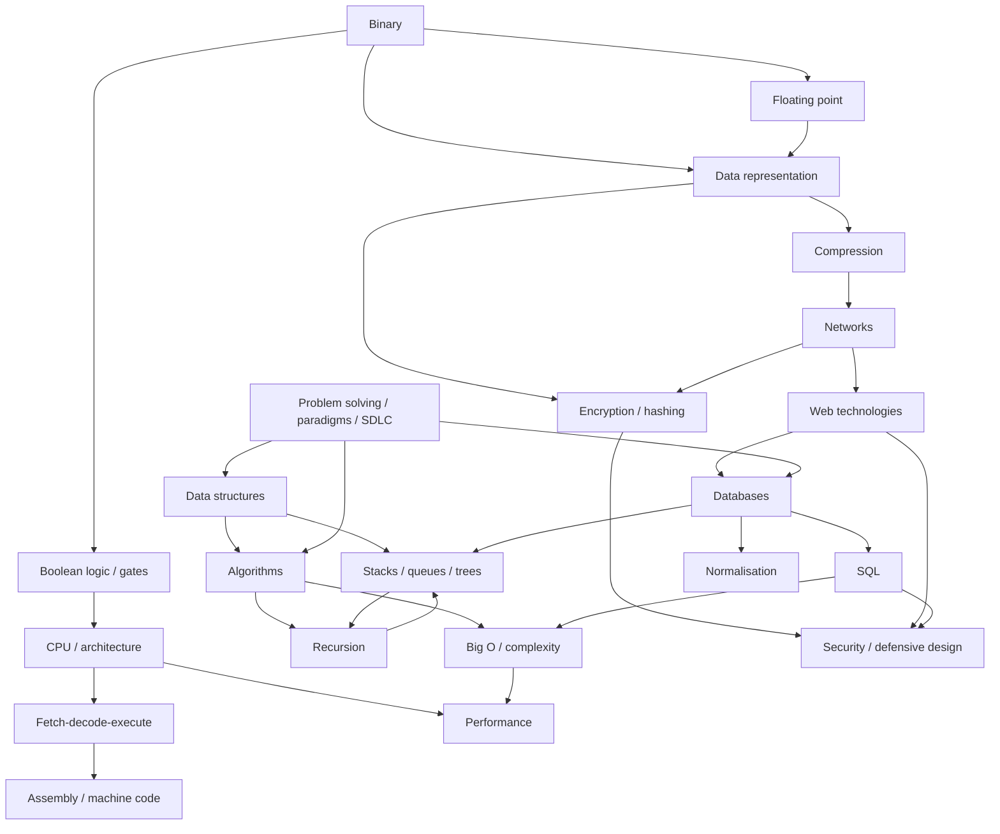

# A* Stretch Pack — 04: Topic Connections Map

> **OCR A Level Computer Science (H446)**
> A* candidates don't see the spec as a list of separate topics — they see one connected system. The exam rewards **synoptic** thinking: explaining how an idea in one area depends on, or mirrors, an idea in another. This resource maps those connections.
>
> **How to use:** Study the diagram to fix the "shape" of the subject in your mind. Then use the connection table to rehearse linking sentences. Finally, practise the synoptic prompts — say your answer out loud, jumping deliberately between topics.

---

## 1. The big picture — how H446 topics interlink

> If your specification reference is by module: this maps roughly onto **1.1** (CPU/architecture), **1.2** (software/programming/paradigms), **1.3** (data exchange: networks, databases, web), **1.4** (data types/structures/Boolean logic), **1.5** (legal/ethical), **2.1** (computational thinking), **2.2** (problem solving, programming, algorithms). The A* skill is crossing those module boundaries on purpose.

---

## 2. "If you understand X, connect it to Y because…"

| If you understand **X** | …connect it to **Y** | …because |
|---|---|---|
| Binary representation | Floating point | Floating point is just *mantissa × 2^exponent* — both store numbers in fixed-width binary, so both inherit **precision/range limits**. |
| Binary fractions | Rounding errors | Many decimals (0.1) **recur in binary**, so floats are approximate — this is *why* currency code accumulates error. |
| Data representation | Compression | Compression reduces the **number of bits** needed; lossy vs lossless is a representation/fidelity trade-off. |
| Compression | Networks | Compressing first means **fewer bits to transmit** → less bandwidth, faster transfer; it sits *before* encryption in the pipeline. |
| Encryption (asymmetric) | Networks / HTTPS | Public-key crypto solves **key distribution** so a fast symmetric key can be shared — the hybrid model behind TLS. |
| Hashing | Both hash tables **and** password security | Same function family, but "fast" is *good* for tables and *dangerous* for passwords — properties invert by context. |
| Boolean logic / gates | CPU & data representation | Gates (AND/OR/XOR) **build the ALU**; a full adder performs binary addition — logic + representation become hardware. |
| Boolean logic | Abstraction | High-level `a + b` ultimately flips transistor voltages; **abstraction layers** hide the gates from the programmer. |
| Fetch-decode-execute | Performance & assembly | Clock speed, cache, cores, pipelining all change **how fast FDE cycles complete**; assembly is FDE made visible (LMC). |
| CPU architecture | Performance | Von Neumann bottleneck, RISC vs CISC, cores and cache **interact** — one factor improved alone hits diminishing returns. |
| Data structures | Algorithms & Big O | The structure chosen **determines achievable complexity** (e.g. hash table → O(1) lookup vs list → O(n)). |
| Stacks | Recursion | Recursion *is* an implicit **call stack**; any recursive routine can be rewritten iteratively with an explicit stack. |
| Stacks | Expression evaluation / compilers | RPN/postfix evaluation and infix→postfix conversion both use a stack — LIFO holds deferred operands/operators. |
| Trees | Recursion & file systems | Hierarchical data (folders, syntax trees) is traversed naturally by recursion — the structure suggests the algorithm. |
| Big O | Database performance | A full table scan is **O(n)**; a sorted index makes lookup **O(log n)** — the same idea as binary vs linear search. |
| Normalisation | Database performance & joins | Normalisation removes redundancy but adds **joins**, which need **indexed foreign keys** — a consistency vs read-speed trade-off. |
| SQL | Security | Concatenating user input enables **SQL injection**; parameterised queries are the link between databases and defensive design. |
| Networks (TCP/IP) | Client–server & web | A web request is packetised, routed, and reassembled; HTTPS adds encryption — the web sits *on top of* the network stack. |
| Programming paradigms (OOP) | Abstraction & maintainability | Encapsulation hides a data structure behind a safe interface, **localising change** — abstraction serving maintainability. |
| Sorting (merge sort) | Recursion, memory & external sorting | Divide-and-conquer mirrors recursion; its O(n) space and sequential merge make it the right choice when data exceeds RAM. |

---

## 3. Five synoptic exam prompts (reward joined-up thinking)

These deliberately span clusters. For each, plan an answer that names **at least three** different H446 topics and states the **link** between them, not just the facts.

1. **"From a photo on your phone to a friend's screen."**
   Trace it: data representation → compression (lossy/lossless) → encryption (hybrid) → packetisation & TCP/IP routing → reassembly. *Link target:* show each stage feeds the next and justify the trade-offs (CPU cost vs bandwidth, reliability vs speed).

2. **"Why is the stack the most important data structure in computer science?"**
   Cover: stacks as a structure (LIFO) → the **call stack** in recursion → **RPN/expression evaluation** in interpreters → returning from subroutines in the **FDE/assembly** context. *Link target:* the same LIFO idea recurs across hardware, languages and algorithms.

3. **"A query is slow. Diagnose it across the whole system."**
   Cover: **Big O** (O(n) full scan) → **indexing** (a sorted structure, O(log n), like binary search) → **normalisation/joins** → **CPU/cache/memory** effects → **network** latency returning results. *Link target:* performance is a system property, not a single cause.

4. **"Everything is ones and zeros — defend or challenge this statement."**
   Cover: **binary** → integers/**floating point**/text/images (**data representation**) → **Boolean logic/gates** building the **CPU** → **abstraction** layers letting us forget the bits. *Link target:* representation + logic + abstraction form one chain from physics to software.

5. **"Choosing the right tool: when does theory force a design decision?"**
   Cover: a real problem (e.g. sort a huge dataset, or store currency) → **algorithmic complexity & space** → **data-structure choice** → **hardware/memory constraints** → a **justified** decision (merge sort/external sort; integers not floats). *Link target:* AO3 — theory (Big O, representation) directly drives a practical, justified choice.

---

### Quick revision drill

Pick any two boxes in the Mermaid diagram at random. In one sentence, state **why an arrow could connect them**. If you can do this fluently for most pairs in a cluster — and for several pairs *across* clusters — you are thinking the way the A* mark scheme rewards.

> **Examiner's one-liner:** Facts get you to a B. **Connections** get you to an A*.
