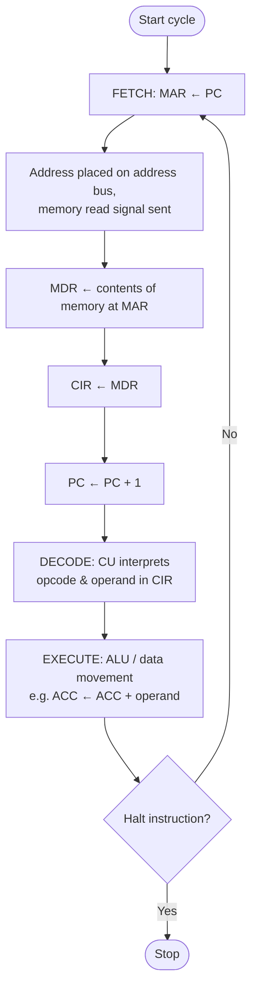
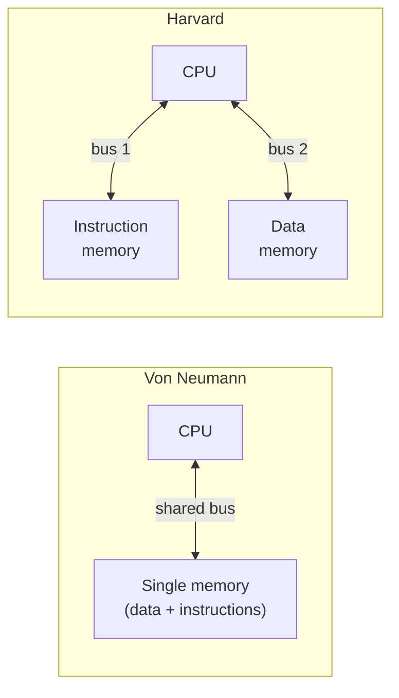
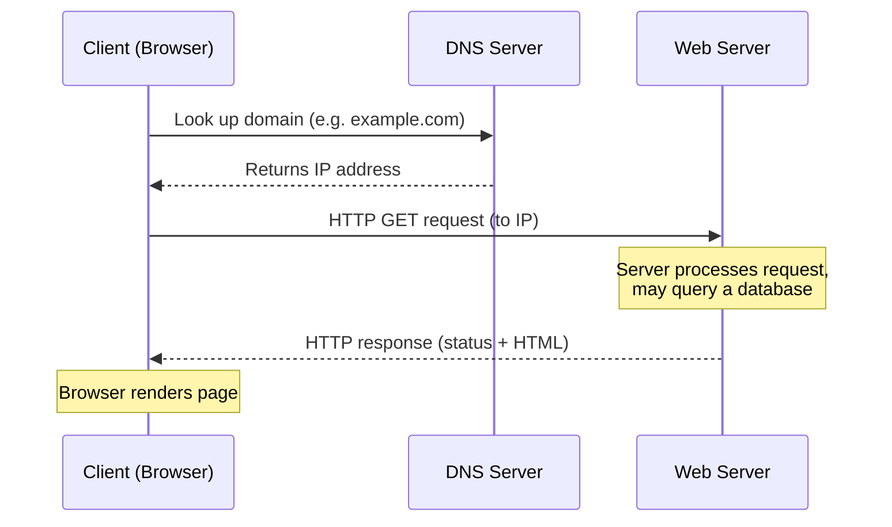
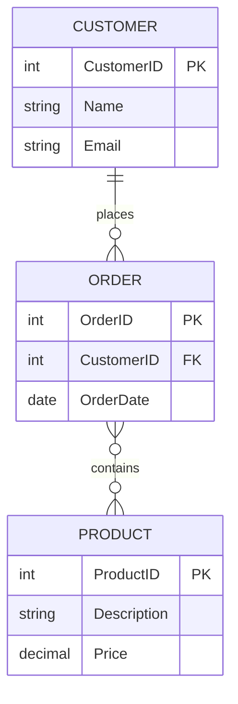
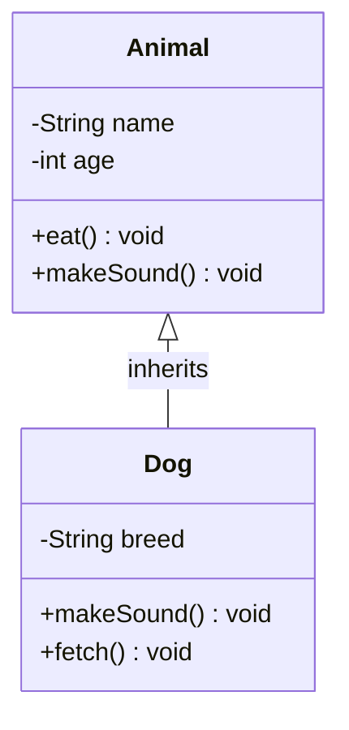
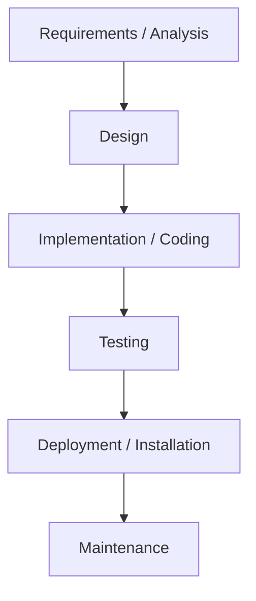
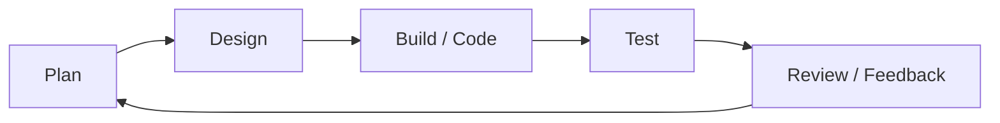
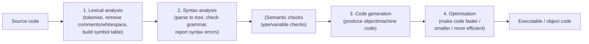

# Diagram Bank — OCR A Level Computer Science (H446)

A collection of clean, labelled diagrams covering the most commonly examined
visual topics. Use these to learn the *shape* of an answer, not just the words.

## How to use this bank

1. **Cover** the diagram with your hand (or a card).
2. **Redraw it from memory** on blank paper, including every label.
3. **Check** against the original. Note anything you missed, then redraw once more.
4. Read the short **"What to remember"** note under each diagram — these are the
   marking points examiners look for.

> Tip: Mermaid blocks render on GitHub automatically. ASCII/Unicode diagrams are
> used for logic circuits, trees and register transfers where boxes-and-arrows
> are clearer and easier to reproduce by hand.

---

## 1. CPU Internal Structure & the Fetch–Decode–Execute Cycle

### 1a. CPU internal structure (ALU, CU, registers, buses)

```
                    ┌───────────────────────── CPU ─────────────────────────┐
                    │                                                        │
                    │   ┌──────────────┐         ┌──────────────────────┐   │
                    │   │ Control Unit │         │ Arithmetic Logic Unit│   │
                    │   │     (CU)      │         │        (ALU)         │   │
                    │   │ decodes &    │         │ +  -  AND  OR  shift  │   │
                    │   │ sequences    │         │ comparisons          │   │
                    │   └──────┬───────┘         └──────────┬───────────┘   │
                    │          │                            │               │
                    │   ┌──────┴────────────────────────────┴──────────┐   │
                    │   │                  Registers                    │   │
                    │   │  PC | MAR | MDR | CIR | ACC | Status Register │   │
                    │   └───────────────────────┬───────────────────────┘  │
                    │                           │                           │
                    └───────────────────────────┼───────────────────────────┘
                                                 │
        ┌──────────────────┬───────────────────┼────────────────────┐
        │  Address Bus     │   Data Bus         │   Control Bus      │
        │  (unidirectional)│  (bidirectional)   │  (signals/timing)  │
        ▼                  ▼                    ▼                    ▼
   ┌─────────────────────────────────────────────────────────────────┐
   │                       Main Memory (RAM)                          │
   └─────────────────────────────────────────────────────────────────┘

   Registers:  PC  = Program Counter (address of NEXT instruction)
               MAR = Memory Address Register (address to read/write)
               MDR = Memory Data Register (data in transit to/from memory)
               CIR = Current Instruction Register (instruction being decoded)
               ACC = Accumulator (results of ALU calculations)
```

**What to remember:** ALU does arithmetic/logic; CU decodes instructions and
sends control signals. Three buses: address (one-way, carries locations), data
(two-way, carries instructions/data), control (timing & command signals). Bus
width affects performance.

### 1b. Fetch–Decode–Execute cycle (flowchart with register transfers)



**What to remember:** Order is fixed — MAR←PC, fetch to MDR, MDR→CIR, **then
increment PC**, decode, execute. The PC is incremented during *fetch*, before
execute. Use the arrow `←` for "is loaded with" in register transfer notation.

---

## 2. Von Neumann vs Harvard Architecture



| Feature            | Von Neumann                     | Harvard                              |
|--------------------|---------------------------------|--------------------------------------|
| Memory             | One memory for data + program   | Separate data & instruction memory   |
| Buses              | Shared (one set)                | Separate buses for each memory       |
| Speed              | Bottleneck (can't fetch both)   | Can fetch instruction + data at once |
| Cost/complexity    | Simpler, cheaper                | More complex/costly                  |
| Typical use        | General-purpose PCs             | Embedded systems, DSPs, microcontrollers |

**What to remember:** Von Neumann = ONE shared memory & bus (the "bottleneck").
Harvard = SEPARATE memories and buses for instructions and data, allowing
simultaneous access. Modern CPUs often use a hybrid (Harvard caches, Von Neumann main memory).

---

## 3. Memory Hierarchy

```
        Fastest, smallest, most expensive per byte
        ▲
        │   ┌─────────────────────────┐
        │   │      Registers          │   < 1 KB,   ~1 cycle
        │   ├─────────────────────────┤
   S    │   │      Cache L1           │   ~32 KB    fastest cache
   P    │   ├─────────────────────────┤
   E    │   │      Cache L2           │   ~256 KB
   E    │   ├─────────────────────────┤
   D    │   │      Cache L3 (shared)  │   ~ several MB
        │   ├─────────────────────────┤
        │   │   Main Memory (RAM)     │   GBs,  volatile
        │   ├─────────────────────────┤
        │   │ Virtual Memory /        │   on secondary storage
        │   │ Secondary Storage       │   (HDD/SSD), non-volatile
        │   └─────────────────────────┘
        ▼
        Slowest, largest, cheapest per byte
```

**What to remember:** As you go DOWN: capacity ↑, cost-per-byte ↓, speed ↓.
Cache (L1→L2→L3) sits between registers and RAM to reduce the speed gap.
Virtual memory uses secondary storage as an extension of RAM when RAM is full.

---

## 4. Network Topologies & the TCP/IP Stack

### 4a. Topologies

```
   STAR                         MESH                          BUS
                                                
        [N]                  [N]───────[N]              [N]   [N]   [N]
         │                    │ \     / │                │     │     │
   [N]──[Switch]──[N]         │   \ /   │           ═════╪═════╪═════╪═════  backbone
         │                    │   / \   │                │     │     │     │
        [N]                  [N]───────[N]              [N]   [N]  terminator
                            (every node linked
   central switch/hub        to every other)        shared single cable
```

| Topology | Pros                                   | Cons                                  |
|----------|----------------------------------------|---------------------------------------|
| Star     | Fast; one cable fault isolates 1 node  | Central switch failure = whole network down |
| Mesh     | Very resilient; no single point of fail | Lots of cabling/cost (full mesh)      |
| Bus      | Cheap, little cabling                   | Collisions; backbone fault kills all  |

### 4b. TCP/IP 4-layer model

```
┌───────────────────────────────────────────────────────────────┐
│ Application   │ HTTP, HTTPS, FTP, SMTP, IMAP, POP3, DNS         │  ← user-facing protocols
├───────────────────────────────────────────────────────────────┤
│ Transport     │ TCP (reliable), UDP (fast)  — ports, segments   │  ← end-to-end, splits into packets
├───────────────────────────────────────────────────────────────┤
│ Internet      │ IP, ICMP  — IP addressing & routing             │  ← adds IP addresses, routes
├───────────────────────────────────────────────────────────────┤
│ Link / Network│ Ethernet, Wi-Fi, MAC addressing                 │  ← physical transmission, MAC
└───────────────────────────────────────────────────────────────┘
```

**What to remember:** Four layers top-to-bottom: **Application, Transport,
Internet, Link**. Data is encapsulated going down (headers added) and
de-encapsulated going up. Know one or two example protocols per layer.

---

## 5. Client–Server Request/Response Model



**What to remember:** Client *requests*, server *responds*. A DNS lookup
resolves the domain name to an IP first. Communication uses request/response
messages (e.g. HTTP GET/POST). The server holds the resource; the client initiates.

---

## 6. Entity-Relationship Diagram (Customer–Order–Product)



Crow's-foot reminder (read left-to-right):

```
  CUSTOMER  1 ────────< ∞  ORDER        "one Customer places many Orders"
  ORDER     ∞ >────────< ∞ PRODUCT      "many-to-many (resolved by a link table)"
```

**What to remember:** PK = Primary Key (unique identifier), FK = Foreign Key
(links to a PK in another table). The "crow's foot" (∞ / many) goes on the
"many" side. A many-to-many relationship is normally broken down with a linking
(junction) table, e.g. ORDER_LINE.

---

## 7. Logic Gates, Half/Full Adder & a Sample Circuit

### 7a. Gate symbols and truth recap

```
  AND  : D─       Output 1 only if BOTH inputs are 1
  OR   : ⊃─       Output 1 if EITHER input is 1
  NOT  : ▷o       Inverts the input (1→0, 0→1)
  XOR  : ⊅─       Output 1 if inputs are DIFFERENT
  NAND : D-o      NOT AND
  NOR  : ⊃-o      NOT OR
```

| A | B | AND | OR | XOR | NAND | NOR |
|---|---|-----|----|----|------|-----|
| 0 | 0 |  0  | 0  | 0  |  1   |  1  |
| 0 | 1 |  0  | 1  | 1  |  1   |  0  |
| 1 | 0 |  0  | 1  | 1  |  1   |  0  |
| 1 | 1 |  1  | 1  | 0  |  0   |  0  |

### 7b. Half adder (adds two bits A, B → Sum, Carry)

```
        ┌───────┐
  A ──┬─┤  XOR  ├─────────────► SUM   (S = A XOR B)
      │ └───────┘
  B ─┬┼─────────┐
     ││ ┌───────┐
     └┼─┤  AND  ├─────────────► CARRY (C = A AND B)
      └─┤       │
        └───────┘

  A B | SUM CARRY
  0 0 |  0    0
  0 1 |  1    0
  1 0 |  1    0
  1 1 |  0    1
```

### 7c. Full adder (adds A, B and Carry-In → Sum, Carry-Out)

```
                ┌──────────┐                ┌──────────┐
  A ───────────►│  Half    │── S1 ─────────►│  Half    │──────────► SUM
  B ───────────►│  Adder 1 │           ┌───►│  Adder 2 │
                │          │── C1 ──┐  │    │          │── C2 ──┐
                └──────────┘        │  │    └──────────┘        │
  Cin ─────────────────────────────┼──┘                        │
                                    │        ┌──────┐           │
                                    └───────►│  OR  │◄──────────┘
                                             └──┬───┘
                                                └──────────────► CARRY-OUT

  SUM       = (A XOR B) XOR Cin
  CARRY-OUT = (A AND B) OR (Cin AND (A XOR B))
```

### 7d. Sample logic circuit

```
  A ──┬──────────┐
      │       ┌──┴──┐
      │       │ AND ├──┐
  B ──┼───┬───┤     │  │   ┌─────┐
      │   │   └─────┘  └───┤     │
      │   │                │ OR  ├──── Q     Q = (A AND B) OR (NOT A)
      │   │   ┌─────┐  ┌───┤     │
  A ──┘   │   │ NOT ├──┘   └─────┘
          │   └─────┘
          (B unused on lower branch)
```

**What to remember:** Half adder = 1 XOR (sum) + 1 AND (carry), **no carry-in**.
Full adder = two half adders + an OR gate, **handles a carry-in**. Chain full
adders to add multi-bit numbers (ripple adder). Always be ready to write the
Boolean expression and a truth table.

---

## 8. Data Structures

### 8a. Stack (LIFO) and Queue (FIFO)

```
   STACK (Last In, First Out)            QUEUE (First In, First Out)
   push/pop at the TOP only              enqueue at REAR, dequeue at FRONT

        ┌──────┐  ◄── top (push/pop)        front                rear
        │  30  │                            │                    │
        ├──────┤                            ▼                    ▼
        │  20  │                         ┌──────┬──────┬──────┬──────┐
        ├──────┤                         │  10  │  20  │  30  │  40  │
        │  10  │                         └──────┴──────┴──────┴──────┘
        └──────┘  ◄── base               dequeue ◄          ◄ enqueue
```

### 8b. Singly linked list with pointers

```
  head
   │
   ▼
  ┌──────┬───┐   ┌──────┬───┐   ┌──────┬───┐   ┌──────┬──────┐
  │ "A"  │ ●─┼──►│ "B"  │ ●─┼──►│ "C"  │ ●─┼──►│ "D"  │ null │
  └──────┴───┘   └──────┴───┘   └──────┴───┘   └──────┴──────┘
   data  next     data  next     data  next     data  next=∅
```

### 8c. Binary search tree

```
                 ┌────┐
                 │ 50 │
                 └─┬──┘
          ┌────────┴────────┐
       ┌──┴─┐            ┌───┴──┐
       │ 30 │            │  70  │
       └─┬──┘            └──┬───┘
     ┌───┴───┐          ┌───┴───┐
  ┌──┴─┐  ┌──┴─┐     ┌──┴─┐  ┌──┴─┐
  │ 20 │  │ 40 │     │ 60 │  │ 80 │
  └────┘  └────┘     └────┘  └────┘

  Rule: left child < parent < right child
```

### 8d. Small weighted graph (for Dijkstra)

```
            (4)
        A ───────── B
        │ \         │
     (1)│  \(7)     │(3)
        │   \       │
        D ───┐ \    C
        │ (5)│  \  /
     (2)│    └── E
        │       /
        F ─────┘ (6)

  Edges:  A-B = 4   A-D = 1   A-E = 7
          B-C = 3   D-E = 5   D-F = 2
          E-F = 6
```

**What to remember:** Stack = LIFO (push/pop one end); Queue = FIFO (enqueue rear,
dequeue front). Linked list nodes hold *data* + a *pointer* to the next node; the
last points to null. In a BST: left < node < right. For Dijkstra, label each edge
with its weight (cost).

---

## 9. Binary Tree Traversals (one example tree)

```
                 ┌───┐
                 │ F │
                 └─┬─┘
          ┌────────┴────────┐
        ┌─┴─┐             ┌─┴─┐
        │ B │             │ G │
        └─┬─┘             └─┬─┘
      ┌───┴───┐             └───┐
    ┌─┴─┐   ┌─┴─┐             ┌─┴─┐
    │ A │   │ D │             │ I │
    └───┘   └─┬─┘             └─┬─┘
          ┌───┴───┐         ┌───┘
        ┌─┴─┐   ┌─┴─┐     ┌─┴─┐
        │ C │   │ E │     │ H │
        └───┘   └───┘     └───┘
```

| Traversal              | Rule (visit order)          | Output                       |
|------------------------|-----------------------------|------------------------------|
| **Pre-order**  (NLR)   | Node → Left → Right         | F B A D C E G I H            |
| **In-order**   (LNR)   | Left → Node → Right         | A B C D E F G H I            |
| **Post-order** (LRN)   | Left → Right → Node         | A C E D B H I G F            |
| **BFS** (breadth-first)| Level by level, top to bottom | F B G A D I C E H          |

**What to remember:** The position of **N** (Node) names the traversal: pre =
*before* children, in = *between*, post = *after*. In-order on a BST gives sorted
output. BFS uses a **queue** and visits level by level; the depth-first traversals
use recursion (a stack).

---

## 10. OOP Class Diagram (Inheritance)



```
  ┌──────────────────────┐
  │       Animal         │   ← parent / superclass / base class
  ├──────────────────────┤
  │ - name : String      │   attributes (- = private)
  │ - age  : int         │
  ├──────────────────────┤
  │ + eat()              │   methods (+ = public)
  │ + makeSound()        │
  └──────────▲───────────┘
             │  (inheritance: "Dog IS-A Animal")
  ┌──────────┴───────────┐
  │         Dog          │   ← child / subclass / derived class
  ├──────────────────────┤
  │ - breed : String     │   adds its own attribute
  ├──────────────────────┤
  │ + makeSound()        │   overrides (polymorphism)
  │ + fetch()            │   adds its own method
  └──────────────────────┘
```

**What to remember:** The hollow triangle arrow points **from subclass to
superclass**. `-` = private, `+` = public. The subclass **inherits** all parent
attributes/methods, can **add** new ones and **override** (polymorphism). Top
compartment = name, middle = attributes, bottom = methods.

---

## 11. Software Development Lifecycle: Waterfall vs Agile

### 11a. Waterfall (linear, sequential)



### 11b. Agile / iterative (repeating loop)



**What to remember:** Waterfall = one pass, each stage finished before the next;
good when requirements are fixed, poor at handling change. Agile = short repeated
iterations with continuous client feedback; flexible, adapts to changing
requirements, delivers working software early.

---

## 12. Stages of Compilation



**What to remember:** Order is **Lexical → Syntax → Code generation →
Optimisation**. Lexical analysis makes *tokens* and the *symbol table*; syntax
analysis builds a *parse/abstract syntax tree* and finds syntax errors; code
generation outputs machine/object code; optimisation improves efficiency
(speed/size) without changing behaviour.

---

*End of diagram bank. Redraw, check, repeat. Aim to reproduce every label.*
